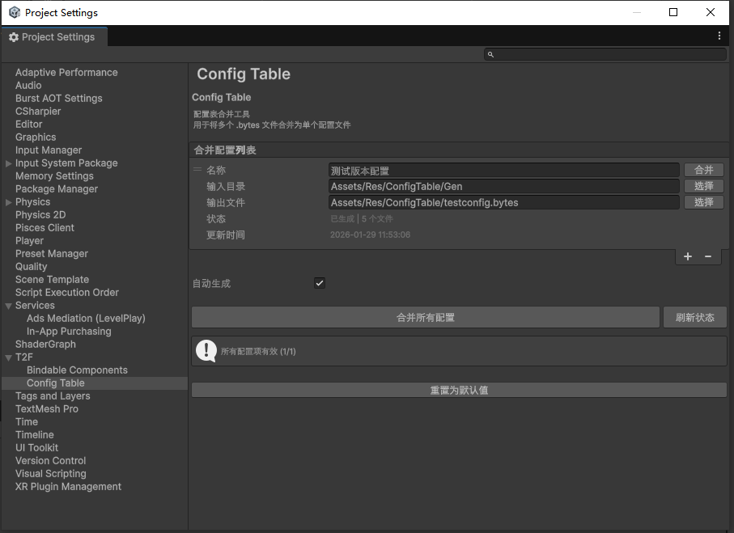

# T2FConfigTable

基于 Luban 的轻量级配置表框架，支持二进制文件合并、延迟加载、自动生成和编辑器工具。

## 特性

- **框架与业务解耦** - 生成的配置表代码放在项目中，框架可独立复用
- **泛型单例基类** - `ConfigTablesBase<T>` 提供统一的初始化和访问接口
- **延迟加载** - 支持按需加载单个表，减少初始化时间和内存占用
- **二进制合并** - 将多个 `.bytes` 文件合并为单个文件，减少加载次数
- **自动生成** - 监听文件变化，自动触发合并
- **编辑器工具** - 可视化配置管理窗口
- **增量检测** - MD5 哈希检测，跳过未变化的文件

## 目录结构

```
T2FConfigTable/
├── Runtime/Core/
│   ├── ConfigTablesBase.cs     # 泛型单例基类（支持延迟加载）
│   └── BytesFileHandler.cs     # 二进制打包/解包
├── Editor/
│   ├── BytesFileMerger.cs      # 自动合并处理器
│   ├── MergeConfig.cs          # 合并配置
│   └── MergeConfigEditor.cs    # 编辑器窗口
└── Templates/                  # Luban 自定义模板（内置）
    └── cs-bin/
        └── tables.sbn          # Tables 类生成模板（支持延迟加载）
```

**注意**：本框架依赖 Luban 运行时库，需要先安装 Luban Unity 包。

## 安装

### 通过 Package Manager 安装

**步骤 1：安装 Luban Unity 运行时库**

1. 打开 Unity 编辑器，菜单栏选择 `Window > Package Manager`
2. 点击左上角 `+` 按钮，选择 `Install package from git URL...`
3. 输入以下地址并点击 `Install`：
```
https://gitee.com/focus-creative-games/luban_unity.git
```

**步骤 2：安装 T2FConfigTable**

1. 再次点击 `+` 按钮，选择 `Install package from git URL...`
2. 输入以下地址并点击 `Install`：
```
https://github.com/unittt/T2FConfigTable.git
```

## 快速开始

### 1. 生成配置表代码

使用 Luban 生成配置表代码。框架提供了内置模板（`T2FConfigTable/Templates/cs-bin/tables.sbn`），会自动让生成的 `Tables` 类继承 `ConfigTablesBase<Tables>` 并支持延迟加载。

**生成的代码示例：**

```csharp
// 生成的代码
namespace T2F.ConfigTable
{
    public partial class Tables : ConfigTablesBase<Tables>
    {
        // 私有字段
        private GameModule.TbItemBean _TbItemBean;

        // 延迟加载属性
        public GameModule.TbItemBean TbItemBean =>
            _TbItemBean ?? LoadTableLazy(ref _TbItemBean, "tbitembean",
                bytes => new GameModule.TbItemBean(bytes));

        protected override void OnLoad(Func<string, ByteBuf> loader)
        {
            var TbItemBeanBytes = loader("tbitembean");
            if (TbItemBeanBytes != null)
                _TbItemBean = new GameModule.TbItemBean(TbItemBeanBytes);
        }

        protected override void OnResolveRef()
        {
            _TbItemBean?.ResolveRef(this);
        }
    }
}
```

### 2. 配置合并规则

打开菜单 `T2F > Config Table Manager`，添加合并配置：

| 字段 | 说明 |
|------|------|
| 名称 | 配置项名称（用于标识） |
| 输入目录 | 包含 `.bytes` 文件的目录 |
| 输出文件 | 合并后的输出文件路径 |

### 3. 初始化配置表

**立即加载模式（生产环境推荐）：**

```csharp
// 加载合并后的二进制文件
byte[] mergedBytes = LoadMergedBytes();

// 初始化并立即加载所有表
Tables.Init(mergedBytes);

// 访问配置（已加载）
var item = Tables.Instance.TbItemBean[1001];
```

**延迟加载模式（开发调试/内存受限场景）：**

```csharp
// 加载合并后的二进制文件
byte[] mergedBytes = LoadMergedBytes();

// 延迟初始化（仅存储字节数据，不加载表）
Tables.InitLazy(mergedBytes);

// 访问配置（首次访问时自动加载该表）
var item = Tables.Instance.TbItemBean[1001];

// 查看加载状态
Debug.Log($"已加载: {Tables.Instance.LoadedTableCount}/{Tables.Instance.TotalTableCount}");

// 需要跨表引用时，手动解析引用
Tables.Instance.ResolveAllRefs();

// 节省内存：释放原始字节数据（之后无法再延迟加载新表）
Tables.Instance.ReleaseRawBytes();
```

## API 参考

### ConfigTablesBase<T>

```csharp
// ===== 静态属性 =====
public static T Instance { get; }           // 单例实例
public static bool IsInitialized { get; }   // 是否已初始化

// ===== 实例属性 =====
public bool IsLazyMode { get; }             // 是否为延迟加载模式
public bool IsRefResolved { get; }          // 是否已解析引用
public int LoadedTableCount { get; }        // 已加载的表数量
public int TotalTableCount { get; }         // 总表数量

// ===== 立即加载 =====
public static void Init(byte[] mergedBytes);           // 从合并字节初始化
public static void Init(Dictionary<string, byte[]>);   // 从字典初始化

// ===== 延迟加载 =====
public static void InitLazy(byte[] mergedBytes);       // 延迟初始化（从合并字节）
public static void InitLazy(Dictionary<string, byte[]>); // 延迟初始化（从字典）

// ===== 实例方法 =====
public bool IsTableLoaded(string tableName);  // 检查表是否已加载
public void LoadAllTables();                  // 加载所有未加载的表
public void ResolveAllRefs();                 // 解析所有引用关系
public void ReleaseRawBytes();                // 释放原始字节数据

// ===== 释放 =====
public static void Release();                 // 释放实例
```

## 延迟加载使用场景

| 场景 | 推荐模式 | 说明 |
|------|----------|------|
| 生产环境 | `Init()` | 一次性加载所有表，避免运行时卡顿 |
| 开发调试 | `InitLazy()` | 快速启动，按需加载 |
| 内存受限设备 | `InitLazy()` | 减少内存占用 |
| 大型配置表 | `InitLazy()` | 分散加载压力 |

### 延迟加载注意事项

1. **引用解析**：延迟模式下 `ResolveRef` 不会自动调用。如果表之间有引用关系，需要在所有相关表加载后手动调用 `ResolveAllRefs()`。

2. **首次访问延迟**：延迟模式下，首次访问某个表会触发加载，可能产生微小延迟。

3. **内存管理**：调用 `ReleaseRawBytes()` 后无法再延迟加载新表，但可以节省内存。

## 编辑器工具

### Config Table Manager



菜单路径：`T2F > Config Table Manager`

功能：
- 添加/删除/排序合并配置
- 单项合并或全部合并
- 显示文件状态和更新时间
- 自动生成开关

### 自动合并

启用"自动生成"后，当输入目录中的 `.bytes` 文件发生变化时，会自动触发合并。

## Luban 模板配置

框架内置了自定义 Luban 模板以支持延迟加载，位于 `T2FConfigTable/Templates/cs-bin/tables.sbn`。

### 模板功能

- 生成的 `Tables` 类继承 `ConfigTablesBase<Tables>`
- 自动实现延迟加载属性访问器
- 实现 `OnLoad()` 方法用于立即加载
- 实现 `OnResolveRef()` 方法用于解析表间引用

### 生成命令示例

在 Luban 生成命令中，通过 `--customTemplateDir` 参数指向框架的 Templates 目录。

**注意**：模板路径根据安装方式不同：
- **Package Manager 安装**：`Packages/com.t2f.configtable/Templates`
- **Assets 目录安装**：`Assets/T2FConfigTable/Templates`

```batch
@echo off
cd /d "%~dp0"

set WORKSPACE=..

set LUBAN_DLL=%WORKSPACE%\Tools\Luban\Luban.dll
set CONF_ROOT=%WORKSPACE%\DataTables
set OUTPUTCODEDIR=%WORKSPACE%\Assets\Scripts\Runtime\ConfigTable\Gen
set OUTPUTDATADIR=%WORKSPACE%\Assets\Res\ConfigTable\Gen

:: 根据安装方式选择模板路径
:: Package Manager 安装使用此路径：
set TEMPLATEDIR=%WORKSPACE%\Packages\com.t2f.configtable\Templates
:: Assets 目录安装使用此路径：
:: set TEMPLATEDIR=%WORKSPACE%\Assets\T2FConfigTable\Templates

dotnet %LUBAN_DLL% ^
    -t client ^
    -c cs-bin ^
    -d bin ^
    --conf %CONF_ROOT%\luban.conf ^
    --customTemplateDir %TEMPLATEDIR% ^
    -x cs-bin.outputCodeDir=%OUTPUTCODEDIR% ^
    -x outputDataDir=%OUTPUTDATADIR% ^
    -x pathValidator.rootDir=%WORKSPACE% ^
    -x inputDataDir=%CONF_ROOT%\Datas

pause
```

### 关键参数说明

| 参数 | 说明 |
|------|------|
| `--customTemplateDir` | 指向框架内的 Templates 目录 |
| `-x cs-bin.outputCodeDir` | 生成的代码输出目录（放在项目中） |
| `-x outputDataDir` | 生成的数据文件输出目录 |

## 模板定制

### 模板结构

框架内置的模板位于 `T2FConfigTable/Templates/cs-bin/tables.sbn`，使用 Scriban 模板语法。

**核心功能：**

1. **延迟加载属性**：每个表都生成属性访问器，首次访问时自动加载
```csharp
public {{table.full_name}} {{table.name}} =>
    _{{table.name}} ?? LoadTableLazy(ref _{{table.name}}, "{{table.output_data_file}}",
        bytes => new {{table.full_name}}(bytes));
```

2. **立即加载方法**：`OnLoad()` 在 `Init()` 时一次性加载所有表
```csharp
protected override void OnLoad(Func<string, ByteBuf> loader)
{
    var tableBytes = loader("tablename");
    if (tableBytes != null)
        _table = new TableType(tableBytes);
}
```

3. **引用解析方法**：`OnResolveRef()` 处理表间引用关系
```csharp
protected override void OnResolveRef()
{
    _table?.ResolveRef(this);
}
```

### 自定义模板

如需修改生成逻辑，可以编辑 `T2FConfigTable/Templates/cs-bin/tables.sbn` 模板文件。模板使用 Luban 提供的变量：

| 变量 | 类型 | 说明 |
|------|------|------|
| `__name` | string | Tables 类名 |
| `__namespace` | string | 命名空间 |
| `__tables` | array | 所有表的定义数组 |
| `table.name` | string | 表名 |
| `table.full_name` | string | 表的完整类名 |
| `table.output_data_file` | string | 数据文件名（不含扩展名） |
| `table.comment` | string | 表的注释 |

**Scriban 语法参考：**
- `{{~ ... ~}}` - 去除空白
- `{{for item in items}}...{{end}}` - 循环
- `{{if condition}}...{{end}}` - 条件判断
- `{{format_property_name style name}}` - 格式化函数

### 工具依赖
- [Luban Unity 运行时库](https://gitee.com/focus-creative-games/luban_unity)
- [Luban GitHub](https://github.com/focus-creative-games/luban)

## 许可证

MIT License
